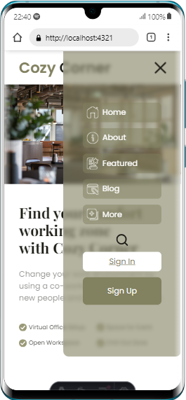

# Coworking Space
- Este proyecto de Header para una pagina web diseñada inicialmente para pantallas de escritorio, sin embargo es conveniente iniciar el proyecto acoplando el diseño a pantallas móviles. Esta es la primera versión del proyecto llevada a una pantalla móvil.

Proyecto original(1920px)

## Tareas realizadas:

### Diseño Mobile
- [✔] Se incorporarán iconos de menú y cierre de menú.
- [✔] Ajustar el nav en una posicion absoluta que aparecerá al darle click al menu.
- [_] Incorporar una barra de busqueda que aparecerá al darle a al icono.
- [_] Añadir iconos svg a cada elemento de la lista que se relacione con el contenido.

### Diseño TABLET
- [✔] El nav oculto aun permacerá.
- [✔] La imagen "hero" deberá ocupar todo el ancho de la pantalla y el contenido del hero tendra una bur de fondo y se situará al lado derecho de la pantalla.
- [✔] Acoplar todos los titulos  y parrafos ya muy parecido al diseño original.
- [✔] El footer ya esta diseño para se acople automaticamente a pantallas mas grandes.

### Diseño DESKTOP
- [✔] El nav ya no sera oculto y se colocará como en el diseño original.
- [✔] La imagen "hero" deberá ocupar la mitad del ancho de la pantalla y el contenido del hero tendra una bur de fondo y se situará al lado derecho de la pantalla como el diseño original.
- [✔] Acoplar todos los titulos  y parrafos ya muy parecido al diseño original.
- [✔] Se aplicará un ::before al titulo para obtener la línea como muestra en el diseño.
- [✔] El footer ya esta diseño para se acople automaticamente a pantallas mas grandes.

### OPCIONALES
- [✔] Añadir favicon a la página relacionado a la pagina web
- [_] Añadir opción para un modo obscuro.
- [_] Crear páginas para cada elemento del NAV.
- [_] Crear un sign in (simulador).
- [_] Ejercicio de sign up para registrarse(simulador).

### Skills

